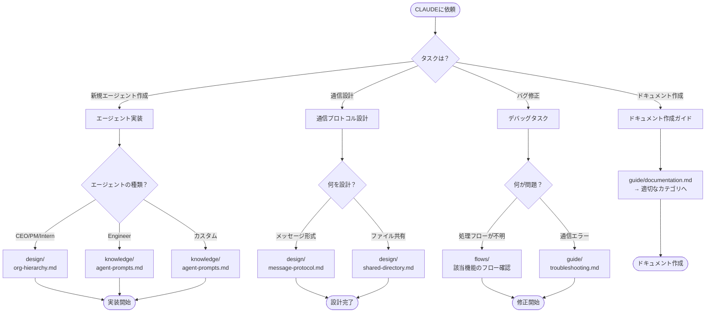

# CLAUDE.md – AI Agent Development Guidelines for agent-corp

## TL;DR - 目的別クイックナビゲーション

目的に応じて以下のセクションへジャンプしてください：

| 目的 | 参照セクション | 所要時間 |
|------|----------------|----------|
| **プロジェクト概要の理解** | [README.md](./README.md) + [ROADMAP.md](./ROADMAP.md) | 5分 |
| **新規エージェント実装** | [docs/knowledge/README.md](./docs/knowledge/README.md) → [prompts/](./prompts/) | 15分 |
| **通信プロトコルの理解** | [docs/design/README.md](./docs/design/README.md) | 10分 |
| **処理フローの確認** | [docs/flows/](./docs/flows/) | 15分 |
| **ドキュメント作成** | [docs/guide/documentation.md](./docs/guide/documentation.md) | 10分 |
| **システム全体像（新規参加）** | [docs/README.md](./docs/README.md) の「最初の1時間」 | 60分 |

### 決定木



---

## Language Preference

- 回答は **基本的に日本語** でお願いします。
- ただし、コード中のコメントや技術用語については英語のままで構いません。

---

## Project Overview

agent-corpは、複数のAIエージェントを階層構造で連携させ、自律的に開発を行う「AI組織」を構築するためのフレームワークです。

### アーキテクチャ概要

```
┌─────────────┐
│   CEO AI    │  ← ビジョン分析・戦略的指示
└──────┬──────┘
       │
   ┌───┴───────────────┐
   │                   │
   ▼                   ▼
┌──────────┐    ┌───────────┐
│  PM AI   │    │Intern AI  │  ← リサーチ・ドキュメント作成
└────┬─────┘    │ (Codex)   │    ※開発以外のタスク
     │          └───────────┘
     │ タスク分解・進捗管理
     │
┌────┴────────────────────────┐
│             │               │
▼             ▼               ▼
┌─────────┐ ┌─────────┐ ┌─────────┐
│Engineer │ │Engineer │ │Engineer │
│   AI    │ │   AI    │ │   AI    │
│(Frontend)│ │(Backend)│ │(Security)│
└─────────┘ └─────────┘ └─────────┘
```

### 主要コンポーネント

| コンポーネント | 説明 | 関連ディレクトリ |
|---------------|------|-----------------|
| **システムプロンプト** | 役割別エージェントの人格・能力定義 | `prompts/` |
| **起動スクリプト** | tmux連携・エージェント起動 | `scripts/` |
| **通信プロトコル** | エージェント間メッセージ規約 | `docs/design/` |
| **共有ディレクトリ** | エージェント間ファイル共有 | TBD |

---

## Knowledge Base

プロジェクト固有の知見やベストプラクティスは、体系的に整理されたドキュメントとして提供されています。

### ドキュメントの全体像

- **[docs/README.md](./docs/README.md)** - ドキュメント全体のインデックスと探し方
- **[docs/knowledge/README.md](./docs/knowledge/README.md)** - 実践的知識（HOW）のインデックス
- **[docs/design/README.md](./docs/design/README.md)** - 設計思想（WHY）のインデックス
- **[docs/flows/README.md](./docs/flows/README.md)** - 処理フロー（WHAT）のインデックス

### 重要ドキュメント

#### エージェント設計（Knowledge）

| ドキュメント | 説明 |
|-------------|------|
| [agent-prompts.md](./docs/knowledge/agent-prompts.md) | エージェントプロンプト設計ガイド |
| [tmux-integration.md](./docs/knowledge/tmux-integration.md) | tmux連携のベストプラクティス |
| [llm-cli-commands.md](./docs/knowledge/llm-cli-commands.md) | LLM CLIコマンド差異（Claude -p vs Codex exec） |
| [token-consumption.md](./docs/knowledge/token-consumption.md) | トークン消費とコスト最適化 |

#### 設計思想（Design）

| ドキュメント | 説明 |
|-------------|------|
| [org-hierarchy.md](./docs/design/org-hierarchy.md) | 組織階層設計（CEO/PM/Intern/Engineer） |
| [message-protocol.md](./docs/design/message-protocol.md) | メッセージプロトコル設計 |
| [shared-directory.md](./docs/design/shared-directory.md) | 共有ディレクトリ設計 |

#### ガイド（Guide）

| ドキュメント | 説明 |
|-------------|------|
| [setup.md](./docs/guide/setup.md) | 環境構築・起動ガイド |
| [tutorial.md](./docs/guide/tutorial.md) | チュートリアル |
| [troubleshooting.md](./docs/guide/troubleshooting.md) | トラブルシューティング |

---

## ディレクトリ構成

```
agent-corp/
├── CLAUDE.md              # ← 今読んでいるファイル（AIエージェント向けガイド）
├── AGENTS.md              # CLAUDE.mdへの誘導
├── README.md              # プロジェクト概要
├── ROADMAP.md             # 開発ロードマップ
├── prompts/               # 役割別システムプロンプト
│   ├── ceo.md
│   ├── pm.md
│   ├── intern.md
│   └── engineers/
│       ├── frontend.md
│       ├── backend.md
│       └── security.md
├── scripts/               # 起動・管理スクリプト
└── docs/                  # ドキュメント
    ├── README.md          # ドキュメントインデックス
    ├── _templates/        # ドキュメントテンプレート
    │   └── flow.md
    ├── flows/             # 処理フロー（WHAT）
    │   └── README.md
    ├── knowledge/         # 実践的知識（HOW）
    │   └── README.md
    ├── design/            # 設計思想（WHY）
    │   └── README.md
    └── guide/             # ガイドライン
        └── documentation.md
```

---

## 実装時の注意点

### 1. LLM非依存設計

- 特定のLLMに依存しない設計を維持する
- Claude, GPT, Gemini など任意のLLMエージェントで動作可能にする
- プロンプトは汎用的な指示形式で記述する

### 2. 階層構造の維持

- 役割別に特化したエージェントが協調動作する
- 上位エージェント（CEO/PM）は戦略的指示を行う
- 下位エージェント（Engineer）は具体的な実装を担当する

### 3. 人間の役割最小化

- 人間は要件定義と最終レビューのみを担当
- エージェント間で自律的にタスクを進行させる

---

## 関連リソース

- [YouTube解説動画](https://youtube.com/shorts/vMhMWPYxLEs)
- [詳細解説動画](https://youtube.com/watch?v=Qxus36eijkM)
