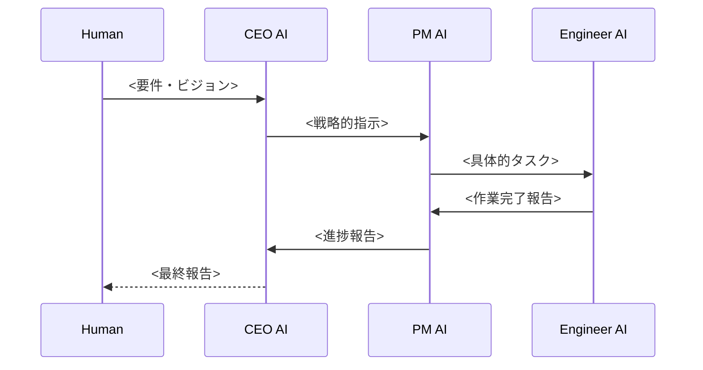

# Flow Template

> このテンプレートは、機能ごとの処理フローを記述するための標準フォーマットです。
> コピーして適切なディレクトリに配置し、<>内を実際の値に置き換えてください。

## ファイルの配置場所

フローが属する機能に応じて、以下のディレクトリに配置してください：

| 対象機能 | ディレクトリ | 例 |
|---------|-------------|-----|
| タスク割り当て | `docs/flows/task-assignment/` | `feature-ceo-to-pm.md` |
| エージェント通信 | `docs/flows/agent-communication/` | `feature-message-exchange.md` |
| エラー復旧 | `docs/flows/error-recovery/` | `feature-agent-restart.md` |

詳細は [`docs/flows/README.md`](../flows/README.md) を参照してください。

---

# Flow: <機能名>

> 概要: <主語>が<何を><どうする>処理
>
> **記述例:**
> - CEOがビジョンを分析し、PMに戦略的指示を送信する処理
> - PMがタスクを分解し、Engineerに作業を割り当てる処理
> - Engineerが作業完了を報告し、PMがレビューを行う処理

---

## 入口（Entry Points）
<!-- フローを開始するトリガーや呼び出し元を明示 -->
- File: `<ファイルパス>` → Function: `<関数名>`
- Trigger: `<人間の指示 / 上位エージェントからの指示 / タイマー>`
  例: 人間がCEOに要件を伝える、PMがEngineerにタスクを割り当てる

---

## 呼び出し順（Call Chain）
<!-- 処理の順序・副作用・失敗パターンを1行ずつ書く -->
1. `<エージェント名>` が `<アクション>`
   - 入力: `<入力値>`
   - 出力: `<出力値>`
   - 副作用: `<ファイル書き込み / メッセージ送信>`
   - 例外: `<発生しうるエラー>`
2. `<次のエージェント>` が `<次のアクション>`
   - 呼び出し: `<下位エージェントや処理列>`
   - 副作用: `<共有ディレクトリへの書き込み>`

---

## 関連ファイル（Related Files）
<!-- このフローと関連するコードマップや契約ファイル -->
- プロンプト: `prompts/<agent>.md`
- スクリプト: `scripts/<script>.sh`
- 設計: `docs/design/<design>.md`
- 補足: `<追加で参照する設計・仕様など>`

---

## 観測点（Observability Hooks）
<!-- 不具合をトレースできるように、ログ/メトリクス/状態を整理 -->
- ログ: `<ログファイルパス>`, `event="<prefix>_start"`, `event="<prefix>_done"`
- 共有ディレクトリ: `<状態ファイルパス>`
- tmuxセッション: `<セッション名>`, `<ペイン番号>`

---

## Mermaid（概要シーケンス）
<!-- 処理の流れを簡潔に図で表現。主要な呼び出しのみに絞る。 -->

---

## 注意事項
<!-- このフロー特有の注意点や制約 -->
- <注意点1>
- <注意点2>

---

## 更新履歴

- YYYY-MM-DD: 初版作成
