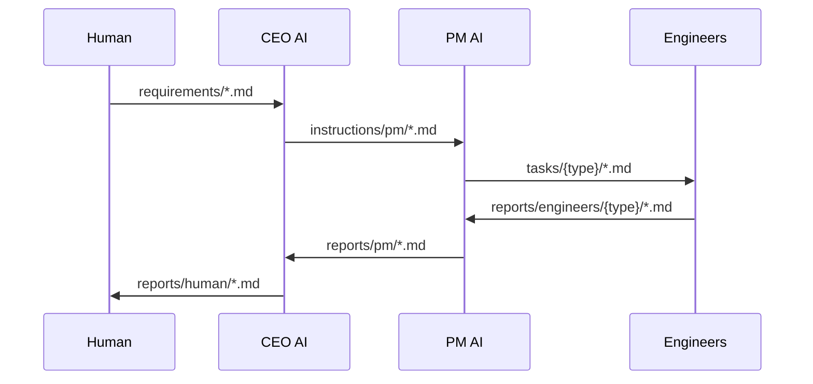
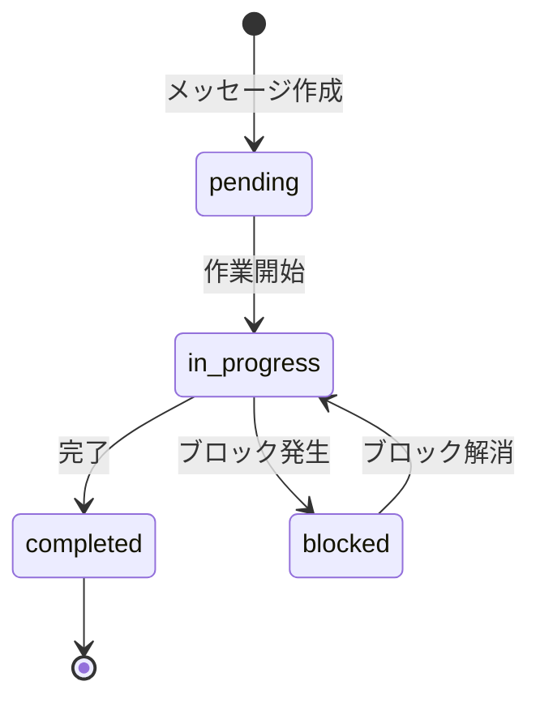

# メッセージプロトコル設計

## 概要

agent-corpにおけるエージェント間通信のプロトコル設計。ファイルベースの非同期通信を採用し、LLM非依存を維持しながら、明確で構造化されたメッセージ交換を実現する。

## 背景

### 検討した選択肢

| 方式 | メリット | デメリット |
|------|---------|-----------|
| **ファイルベース通信** | シンプル、LLM互換性高、履歴が残る | リアルタイム性低 |
| WebSocket/API | リアルタイム性高 | 複雑、LLM依存の可能性 |
| メッセージキュー | 堅牢、スケーラブル | オーバースペック |

### 決定

**ファイルベース通信**を採用。理由：
1. LLMエージェントの標準的なファイル操作能力を活用
2. 実装がシンプルで、どのLLMでも動作
3. 通信履歴がファイルとして残り、デバッグが容易
4. 人間も直接メッセージを確認・編集可能

---

## 通信アーキテクチャ

### 全体フロー



### ディレクトリ構造

```
shared/
├── requirements/           # 人間 → CEO
│   └── {task-id}.md
├── instructions/           # CEO → PM
│   └── pm/
│       └── {task-id}.md
├── tasks/                  # PM → Engineers
│   ├── frontend/
│   │   └── {task-id}.md
│   ├── backend/
│   │   └── {task-id}.md
│   └── security/
│       └── {task-id}.md
├── reports/                # 報告（下位 → 上位）
│   ├── engineers/
│   │   ├── frontend/
│   │   │   └── {task-id}.md
│   │   ├── backend/
│   │   │   └── {task-id}.md
│   │   └── security/
│   │       └── {task-id}.md
│   ├── pm/
│   │   └── {task-id}.md
│   └── human/
│       └── {task-id}.md
├── questions/              # 質問（双方向）
│   ├── {from}-to-{to}/
│   │   └── {question-id}.md
│   └── answers/
│       └── {question-id}.md
└── specs/                  # 仕様共有
    └── api/
        └── {spec-name}.md
```

---

## メッセージフォーマット

### 共通ヘッダー

すべてのメッセージに以下のヘッダーを含める：

```markdown
---
id: {ULID形式のID}
from: {送信者: human|ceo|pm|frontend|backend|security}
to: {宛先: ceo|pm|frontend|backend|security|human}
type: {メッセージタイプ: requirement|instruction|task|report|question|answer}
priority: {優先度: critical|high|medium|low}
status: {ステータス: pending|in_progress|completed|blocked}
created_at: {ISO 8601形式}
updated_at: {ISO 8601形式}
parent_id: {親メッセージID（あれば）}
---
```

---

## メッセージタイプ別フォーマット

### 1. 要件（Requirement）

**用途**: 人間 → CEO
**パス**: `shared/requirements/{task-id}.md`

```markdown
---
id: 01HQXYZ...
from: human
to: ceo
type: requirement
priority: high
status: pending
created_at: 2025-01-24T12:00:00Z
---

# 要件: {タイトル}

## 概要
{何を実現したいか}

## 背景
{なぜ必要か}

## 期待する成果
- {成果1}
- {成果2}

## 制約条件
- {制約1}
- {制約2}

## 優先順位
{最も重要な点}

## 備考
{追加情報}
```

### 2. 指示（Instruction）

**用途**: CEO → PM
**パス**: `shared/instructions/pm/{task-id}.md`

```markdown
---
id: 01HQXYZ...
from: ceo
to: pm
type: instruction
priority: high
status: pending
created_at: 2025-01-24T12:00:00Z
parent_id: {requirement-id}
---

# 指示: {タイトル}

## ゴール
{達成すべき目標}

## コンテキスト
{背景情報、判断の理由}

## 成功基準
- [ ] {基準1}
- [ ] {基準2}

## 制約条件
- {制約1}
- {制約2}

## 推奨アプローチ
{技術的方向性の提案（あれば）}

## 優先順位
{タスク間の優先順位}

## 期限目安
{目安となる期限（あれば）}
```

### 3. タスク（Task）

**用途**: PM → Engineer
**パス**: `shared/tasks/{engineer-type}/{task-id}.md`

```markdown
---
id: 01HQXYZ...
from: pm
to: frontend
type: task
priority: high
status: pending
created_at: 2025-01-24T12:00:00Z
parent_id: {instruction-id}
---

# タスク: {タイトル}

## 説明
{何を実装するか}

## 完了条件
- [ ] {条件1}
- [ ] {条件2}

## 技術要件
- {要件1}
- {要件2}

## 依存関係
- 前提: {他タスクID}（あれば）
- ブロック: {このタスクを待つタスク}（あれば）

## 参考資料
- {リンク1}
- {リンク2}

## 備考
{追加情報}
```

### 4. 報告（Report）

**用途**: Engineer → PM、PM → CEO、CEO → Human
**パス**: `shared/reports/{from}/{task-id}.md`

```markdown
---
id: 01HQXYZ...
from: frontend
to: pm
type: report
priority: medium
status: completed
created_at: 2025-01-24T12:00:00Z
parent_id: {task-id}
---

# 報告: {タイトル}

## ステータス
{completed|in_progress|blocked}

## 完了項目
- [x] {完了した項目1}
- [x] {完了した項目2}

## 残作業
- [ ] {残っている項目}（あれば）

## 成果物
- {ファイルパス1}: {説明}
- {ファイルパス2}: {説明}

## 課題・懸念
- {課題1}（あれば）

## 次のステップ
- {次のアクション}

## 備考
{追加情報}
```

### 5. 質問（Question）

**用途**: 任意のエージェント間
**パス**: `shared/questions/{from}-to-{to}/{question-id}.md`

```markdown
---
id: 01HQXYZ...
from: backend
to: frontend
type: question
priority: high
status: pending
created_at: 2025-01-24T12:00:00Z
context_id: {関連タスクID}
---

# 質問: {タイトル}

## 背景
{質問の背景}

## 質問内容
{具体的な質問}

## 選択肢（あれば）
1. {選択肢A}
2. {選択肢B}

## 緊急度
{なぜ急ぎか、いつまでに回答が必要か}
```

### 6. 回答（Answer）

**用途**: 質問への回答
**パス**: `shared/questions/answers/{question-id}.md`

```markdown
---
id: 01HQXYZ...
from: frontend
to: backend
type: answer
priority: high
status: completed
created_at: 2025-01-24T12:00:00Z
parent_id: {question-id}
---

# 回答: {質問タイトル}

## 回答
{回答内容}

## 理由
{回答の根拠}

## 追加情報
{参考情報}
```

---

## ステータス遷移



---

## ファイル命名規則

### タスクID形式

```
{YYYYMMDD}-{連番3桁}-{種別}

例:
20250124-001-req    # 要件
20250124-002-inst   # 指示
20250124-003-task   # タスク
20250124-004-rep    # 報告
20250124-005-q      # 質問
20250124-006-a      # 回答
```

### ULID使用（推奨）

より堅牢なID管理には[ULID](https://github.com/ulid/spec)を使用：

```
01HQXYZABC1234567890  # ソート可能、衝突しにくい
```

---

## ポーリング戦略

エージェントは担当ディレクトリを定期的に監視：

| エージェント | 監視対象 |
|-------------|---------|
| CEO | `requirements/`, `reports/pm/` |
| PM | `instructions/pm/`, `reports/engineers/*/` |
| Frontend | `tasks/frontend/`, `questions/*-to-frontend/` |
| Backend | `tasks/backend/`, `questions/*-to-backend/` |
| Security | `tasks/security/`, `questions/*-to-security/` |

### 監視スクリプト例

```bash
# 新着メッセージの検出
find shared/tasks/frontend -name "*.md" -newer .last_check -type f
```

---

## 関連ドキュメント

- [docs/design/shared-directory.md](./shared-directory.md) - 共有ディレクトリ設計
- [docs/design/org-hierarchy.md](./org-hierarchy.md) - 組織階層設計
- [docs/flows/agent-communication/](../flows/agent-communication/) - 通信フロー

---

## 更新履歴

- 2025-01-24: 初版作成
