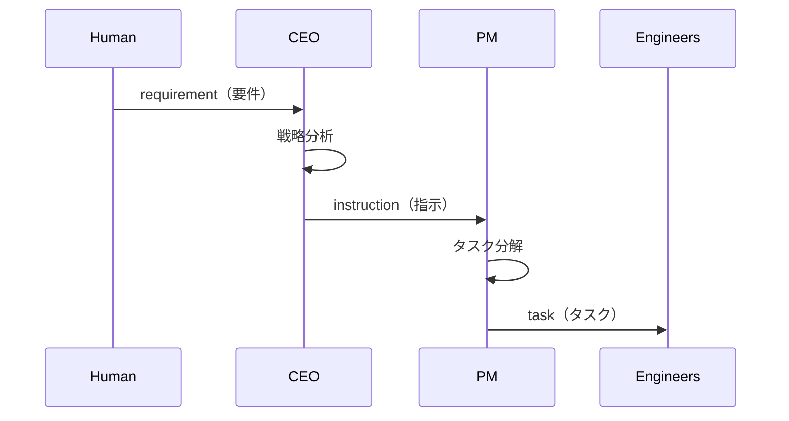
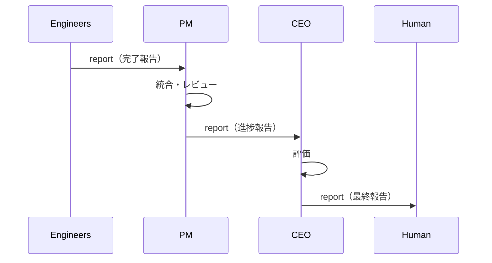
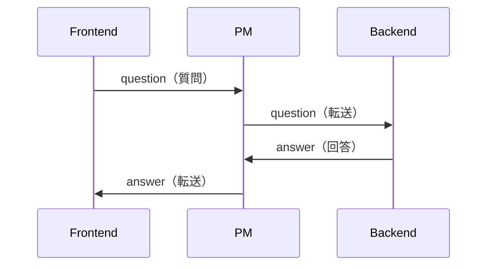

# 組織階層設計

agent-corpにおけるAIエージェントの階層構造と役割分担の設計。

---

## 設計思想

### なぜ階層構造か

| 課題 | 解決策 |
|------|--------|
| 複雑なタスクの管理 | 階層的な分解と委譲 |
| 専門性の確保 | 役割ごとの専門エージェント |
| 品質管理 | 上位者によるレビュー |
| スケーラビリティ | チーム構成の柔軟な拡張 |

### 設計原則

1. **単一責任**: 各エージェントは明確な責任範囲を持つ
2. **最小権限**: 必要最小限のファイルアクセス権限
3. **明確な通信**: 定義されたプロトコルでのみ通信
4. **追跡可能性**: すべての指示と報告を記録

---

## 標準階層構造

### デフォルト構成（3層）

```
                    ┌─────────┐
                    │  Human  │
                    └────┬────┘
                         │ requirement
                         ▼
                    ┌─────────┐
                    │   CEO   │
                    └────┬────┘
                         │ instruction
                         ▼
                    ┌─────────┐
                    │   PM    │
                    └────┬────┘
                         │ task
           ┌─────────────┼─────────────┐
           ▼             ▼             ▼
      ┌─────────┐  ┌─────────┐  ┌─────────┐
      │Frontend │  │ Backend │  │Security │
      └─────────┘  └─────────┘  └─────────┘
```

### 役割定義

| ロール | 責任 | 上位者 | 下位者 |
|--------|------|--------|--------|
| Human | 要件定義、最終承認 | - | CEO |
| CEO | 戦略策定、方向性決定 | Human | PM |
| PM | タスク分解、進捗管理 | CEO | Engineers |
| Frontend | UI/UX実装 | PM | - |
| Backend | API/DB実装 | PM | - |
| Security | セキュリティ対策 | PM | - |

---

## 通信フロー

### 下降フロー（指示）



### 上昇フロー（報告）



### 水平フロー（質問・回答）



---

## 組織テンプレート

### minimal（最小構成）

```yaml
# config/org-templates/minimal.yaml
hierarchy:
  - role: pm
    reports_to: human
    subordinates: [engineer]
  - role: engineer
    reports_to: pm
    subordinates: []
```

```
Human → PM → Engineer
```

**用途**: 小規模タスク、プロトタイプ、学習用

### default（標準構成）

```yaml
# config/org-templates/default.yaml
hierarchy:
  - role: ceo
    reports_to: human
    subordinates: [pm]
  - role: pm
    reports_to: ceo
    subordinates: [frontend, backend, security]
  - role: frontend/backend/security
    reports_to: pm
    subordinates: []
```

```
Human → CEO → PM → [Frontend, Backend, Security]
```

**用途**: 一般的な開発プロジェクト

### large（大規模構成）

```yaml
# config/org-templates/large.yaml
hierarchy:
  - role: ceo
    reports_to: human
    subordinates: [cto, cpo]
  - role: cto
    reports_to: ceo
    subordinates: [pm_backend, pm_infra]
  - role: cpo
    reports_to: ceo
    subordinates: [pm_frontend]
  # ... 以下省略
```

```
Human
  └── CEO
        ├── CTO
        │     ├── PM Backend
        │     │     ├── Backend Senior
        │     │     ├── Backend Junior
        │     │     └── DBA
        │     └── PM Infra
        │           ├── DevOps
        │           ├── Security
        │           └── SRE
        └── CPO
              └── PM Frontend
                    ├── Frontend Senior
                    ├── Frontend Junior
                    └── UI Designer
```

**用途**: 大規模プロジェクト、複数チーム

---

## 権限設計

### アクセス制御マトリックス

| ディレクトリ | Human | CEO | PM | Engineers |
|-------------|-------|-----|-----|-----------|
| requirements/ | RW | R | R | - |
| instructions/pm/ | - | W | R | - |
| tasks/{role}/ | - | - | W | R |
| reports/engineers/ | - | - | R | W |
| reports/pm/ | - | R | W | - |
| reports/human/ | R | W | - | - |
| specs/ | R | RW | RW | R |
| artifacts/ | R | R | RW | RW |

R: 読み取り, W: 書き込み, -: アクセス不可

### 権限の原則

1. **上位者は下位者の出力を読める**
2. **下位者は上位者からの指示を読める**
3. **同階層間は直接通信しない**（PMを経由）
4. **成果物は共有可能**

---

## カスタム階層の設計

### 新規階層の作成手順

1. **要件分析**: プロジェクトの特性を把握
2. **役割定義**: 必要な専門性を特定
3. **階層設計**: 報告ラインを決定
4. **通信設計**: メッセージフローを定義
5. **テンプレート作成**: YAMLファイルを作成

### 設計チェックリスト

```markdown
□ すべてのロールに上位者が定義されている（humanを除く）
□ 通信フローが循環していない
□ 各ロールの責任が明確
□ アクセス権限が最小限
□ エスカレーションパスが存在する
```

### 例: データサイエンスチーム

```yaml
name: "Data Science Team"
hierarchy:
  - role: data_lead
    reports_to: human
    subordinates: [data_engineer, ml_engineer, analyst]

  - role: data_engineer
    reports_to: data_lead
    subordinates: []

  - role: ml_engineer
    reports_to: data_lead
    subordinates: []

  - role: analyst
    reports_to: data_lead
    subordinates: []

communication:
  flows:
    - from: human
      to: data_lead
      types: [requirement]
    - from: data_lead
      to: [data_engineer, ml_engineer, analyst]
      types: [task]
    - from: [data_engineer, ml_engineer, analyst]
      to: data_lead
      types: [report, question]
```

---

## アンチパターン

### 避けるべき設計

| パターン | 問題 | 解決策 |
|----------|------|--------|
| フラット構造 | 責任の曖昧さ | 階層を導入 |
| 深すぎる階層 | 通信オーバーヘッド | 3-4層に制限 |
| 循環参照 | 無限ループ | DAG構造を維持 |
| 権限の過剰付与 | セキュリティリスク | 最小権限原則 |

### 階層の深さガイドライン

| 深さ | 推奨用途 |
|------|---------|
| 2層 | 小規模タスク、PoC |
| 3層 | 標準的なプロジェクト |
| 4層 | 大規模プロジェクト |
| 5層+ | 非推奨（オーバーヘッド大） |

---

## 関連ドキュメント

- [メッセージプロトコル](./message-protocol.md) - 通信規約
- [共有ディレクトリ](./shared-directory.md) - ファイル構成
- [エージェントプロンプト](../knowledge/agent-prompts.md) - プロンプト設計
