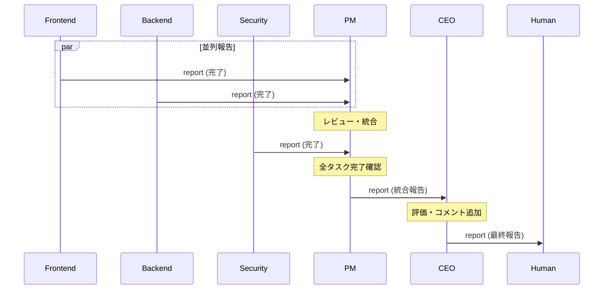

# 報告フロー

Engineerからの完了報告がHumanに届くまでの上昇フロー。

---

## エントリーポイント

| トリガー | 場所 | 形式 |
|----------|------|------|
| Engineer がタスク完了 | `shared/reports/engineers/` | Markdown + YAML frontmatter |

---

## コールチェーン

### 1. Engineer → PM（完了報告）

**入力**: タスク完了

**処理**:
```
1. 成果物を artifacts/ に配置
2. 完了報告を作成
3. reports/engineers/ に配置
```

**出力**:
```yaml
# shared/reports/engineers/report_fe_001.md
---
id: report_fe_001
from: frontend
to: pm
type: report
status: completed
parent_id: task_fe_001
created_at: 2025-01-24T14:00:00+09:00
---
# 登録フォーム実装完了報告

## 完了タスク
task_fe_001: 登録フォームの実装

## 成果物
- `shared/artifacts/frontend/registration-form/`
  - `RegistrationForm.tsx`
  - `validation.ts`
  - `styles.css`

## 実装内容
- メールアドレス入力（バリデーション付き）
- パスワード入力（強度チェック付き）
- 確認用パスワード入力
- リアルタイムエラー表示

## テスト結果
- ユニットテスト: 全12件パス
- E2Eテスト: 全5件パス

## 備考
Backend APIの仕様に合わせて実装済み。
```

**副作用**:
- タスクファイルを archive に移動
- ログに記録

---

### 2. PM → CEO（統合報告）

**入力**: 複数Engineerからの報告

**処理**:
```
1. 各報告をレビュー
2. 統合状況を評価
3. 全体進捗報告を作成
```

**出力**:
```yaml
# shared/reports/pm/report_pm_001.md
---
id: report_pm_001
from: pm
to: ceo
type: report
status: in_progress
parent_id: inst_001
created_at: 2025-01-24T15:00:00+09:00
---
# ユーザー登録機能 進捗報告

## 指示
inst_001: ユーザー登録機能の実装指示

## 進捗サマリー
| タスク | 担当 | 状態 |
|--------|------|------|
| task_fe_001 | Frontend | ✅ 完了 |
| task_be_001 | Backend | ✅ 完了 |
| task_se_001 | Security | 🔄 進行中 |

## 完了タスク詳細

### Frontend (task_fe_001)
- 登録フォームUI完成
- バリデーション実装済み
- テスト全件パス

### Backend (task_be_001)
- 認証API実装完了
- JWT発行機能実装済み
- API仕様書更新済み

## 残作業
- Security レビュー待ち（予定: 本日中）

## リスク
特になし
```

---

### 3. CEO → Human（最終報告）

**入力**: PM からの統合報告

**処理**:
```
1. 報告内容を評価
2. 戦略的観点からコメント追加
3. Human向け報告を作成
```

**出力**:
```yaml
# shared/reports/human/report_ceo_001.md
---
id: report_ceo_001
from: ceo
to: human
type: report
status: completed
parent_id: req_001
created_at: 2025-01-24T17:00:00+09:00
---
# ユーザー登録機能 完了報告

## 要件
req_001: ユーザー登録機能の実装

## ステータス
✅ **完了**

## 成果物一覧
| カテゴリ | ファイル | 説明 |
|----------|----------|------|
| Frontend | `artifacts/frontend/registration-form/` | 登録フォームUI |
| Backend | `artifacts/backend/auth/` | 認証API |
| Security | `artifacts/security/auth-review.md` | セキュリティレビュー |
| API仕様 | `specs/api/auth.yaml` | API仕様書 |

## ハイライト
- セキュリティベストプラクティスに準拠
- レスポンシブデザイン対応
- 100%テストカバレッジ

## セキュリティレビュー結果
- 重大な脆弱性: 0件
- 軽微な指摘: 2件（対応済み）

## 次のステップ（推奨）
1. ステージング環境でのテスト
2. パフォーマンステスト
3. 本番デプロイ
```

---

## シーケンス図



---

## 関連ファイル

| ファイル | 役割 |
|----------|------|
| `prompts/engineers/*.md` | Engineer の報告ロジック |
| `prompts/pm.md` | PM の統合ロジック |
| `prompts/ceo.md` | CEO の評価ロジック |

---

## 観測ポイント

### 状態ファイル

| 場所 | 内容 |
|------|------|
| `shared/reports/engineers/` | Engineer からの報告 |
| `shared/reports/pm/` | PM からの統合報告 |
| `shared/reports/human/` | Human への最終報告 |

### 確認コマンド

```bash
# 報告状況の確認
./scripts/msg.sh list pm --type report

# 最新の報告を表示
./scripts/msg.sh read shared/reports/human/report_ceo_001.md
```

---

## 注意事項

1. **報告の粒度**: 小さなタスクは統合して報告
2. **タイムリーな報告**: 完了後1時間以内に報告
3. **成果物の確認**: 報告前に成果物の存在を確認
4. **parent_id の設定**: トレーサビリティのため必須

---

## 更新履歴

| 日付 | 変更内容 |
|------|---------|
| 2025-01-24 | 初版作成 |
