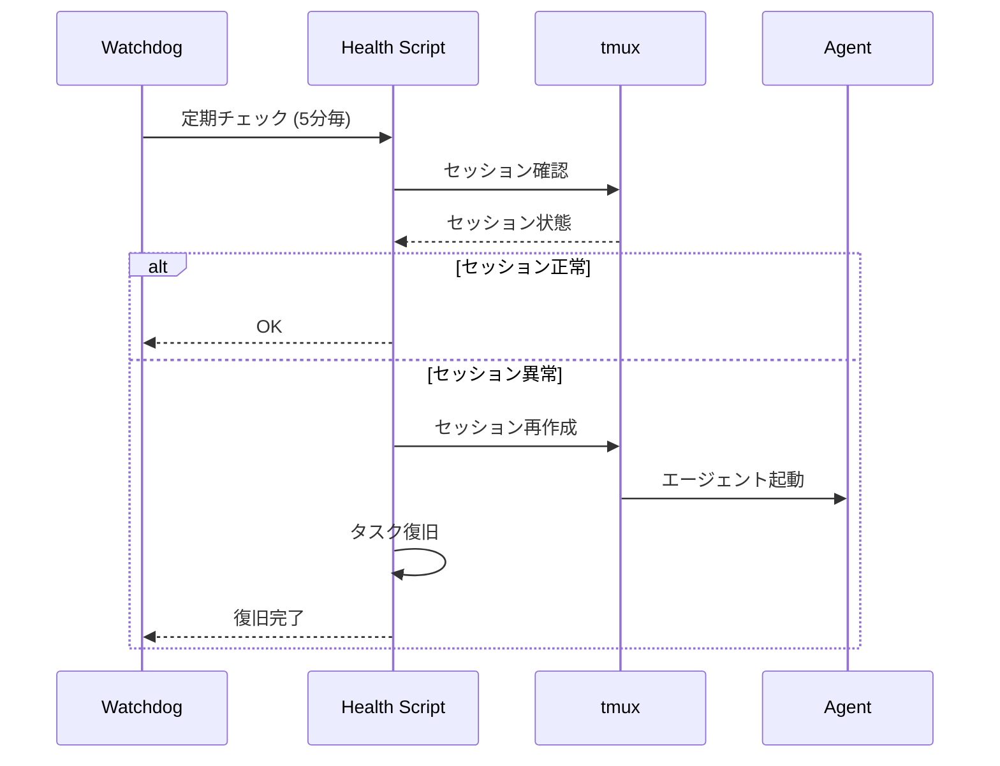
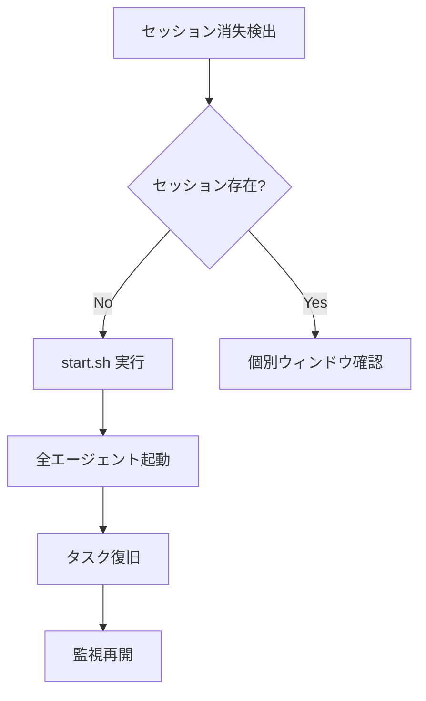
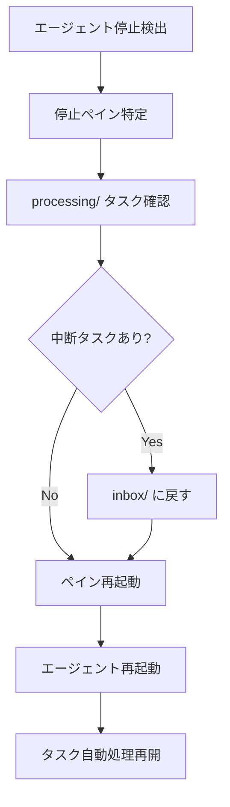
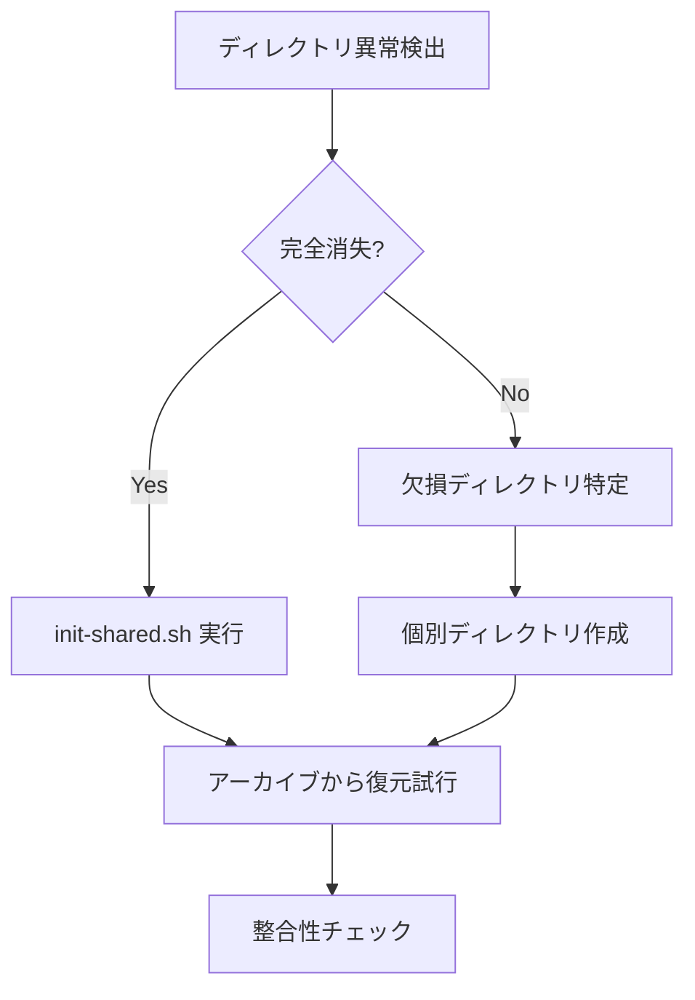

# エージェント再起動フロー

エージェントが停止・エラー状態になった場合のリカバリ手順。

---

## エントリーポイント

| トリガー | 検出方法 | 対応 |
|----------|---------|------|
| エージェント無応答 | ヘルスチェック | 自動再起動 |
| tmuxペイン終了 | セッション監視 | ペイン再作成 |
| 処理タイムアウト | ウォッチドッグ | タスク再割当 |

---

## コールチェーン

### 1. 異常検出

**入力**: ヘルスチェックスクリプト実行

**処理**:
```bash
# scripts/health.sh check
./scripts/health.sh check
```

**検出項目**:
| チェック | 正常 | 異常 |
|----------|------|------|
| tmuxセッション | 存在する | 存在しない |
| 各ウィンドウ | 応答あり | 応答なし |
| 共有ディレクトリ | アクセス可 | アクセス不可 |
| 未処理メッセージ | 処理中 | 滞留 |

**出力**: 異常検出レポート

---

### 2. 自動修復

**入力**: 異常検出結果

**処理**:
```bash
# scripts/health.sh fix
./scripts/health.sh fix
```

**修復アクション**:

#### セッション再作成
```bash
# セッションが存在しない場合
if ! tmux has-session -t agent-corp 2>/dev/null; then
    ./scripts/start.sh
fi
```

#### ペイン再起動
```bash
# 特定ペインが停止している場合
tmux respawn-pane -t agent-corp:engineers.0 -k
tmux send-keys -t agent-corp:engineers.0 \
    "claude --system-prompt prompts/engineers/frontend.md" C-m
```

#### ディレクトリ修復
```bash
# 共有ディレクトリが破損している場合
./scripts/init-shared.sh
```

**出力**: 修復完了レポート

---

### 3. タスク復旧

**入力**: 中断されたタスク

**処理**:
```
1. processing/ 内の中断タスクを検出
2. ステータスを pending にリセット
3. inbox/ に戻す
4. エージェント再起動後に自動処理
```

**実装**:
```bash
# 中断タスクの復旧
for task in shared/tasks/*/processing/*.md; do
    if [ -f "$task" ]; then
        role=$(dirname "$task" | xargs dirname | xargs basename)
        mv "$task" "shared/tasks/$role/inbox/"
        echo "Recovered: $task"
    fi
done
```

---

## シーケンス図



---

## 詳細フロー

### フロー1: tmuxセッション消失



### フロー2: 個別エージェント停止



### フロー3: 共有ディレクトリ破損



---

## 関連ファイル

| ファイル | 役割 |
|----------|------|
| `scripts/health.sh` | ヘルスチェック・修復 |
| `scripts/start.sh` | セッション起動 |
| `scripts/init-shared.sh` | ディレクトリ初期化 |

---

## 観測ポイント

### ログ

| 場所 | 内容 |
|------|------|
| `logs/health.log` | ヘルスチェック結果 |
| `logs/recovery.log` | 復旧処理ログ |

### 監視コマンド

```bash
# リアルタイム監視
./scripts/health.sh watch

# 状態確認
./scripts/health.sh check

# 自動修復
./scripts/health.sh fix
```

---

## 注意事項

1. **データ損失防止**:
   - 復旧前にバックアップ確認
   - processing/ のタスクは慎重に扱う

2. **連続障害対策**:
   - 5分以内に3回以上の障害は手動介入
   - アラート通知を設定

3. **復旧順序**:
   - ディレクトリ → セッション → エージェント → タスク

4. **確認事項**:
   - 復旧後は必ずヘルスチェックを実行
   - 中断タスクの重複処理に注意

---

## トラブルシューティング

| 症状 | 原因 | 対処 |
|------|------|------|
| 復旧後も応答なし | APIキー問題 | 環境変数確認 |
| タスクが重複処理 | 復旧タイミング | ロックファイル確認 |
| セッション作成失敗 | tmux問題 | `tmux kill-server` 後再試行 |

---

## 更新履歴

| 日付 | 変更内容 |
|------|---------|
| 2025-01-24 | 初版作成 |
