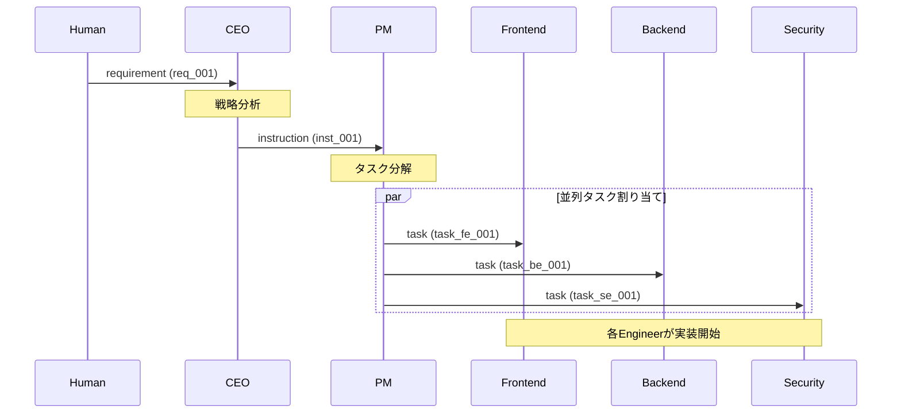

# 要件からタスクへの変換フロー

Humanからの要件がEngineerのタスクに分解されるまでの完全なフロー。

---

## エントリーポイント

| トリガー | 場所 | 形式 |
|----------|------|------|
| Human が要件を投入 | `shared/requirements/` | Markdown + YAML frontmatter |

---

## コールチェーン

### 1. Human → CEO（要件投入）

**入力**:
```yaml
# shared/requirements/req_001.md
---
id: req_001
from: human
to: ceo
type: requirement
priority: high
created_at: 2025-01-24T10:00:00+09:00
---
# ユーザー登録機能の実装

メールアドレスとパスワードでユーザー登録できる機能を追加してください。
```

**処理**: CEO が要件を読み取り、戦略的に分析

**出力**: instruction を PM へ

**副作用**:
- `shared/requirements/req_001.md` → `shared/archive/requirements/` へ移動

---

### 2. CEO → PM（戦略指示）

**入力**: CEO が分析した要件

**処理**:
```
1. 要件の技術的実現可能性を評価
2. 優先順位と方針を決定
3. PMへの指示を作成
```

**出力**:
```yaml
# shared/instructions/pm/inst_001.md
---
id: inst_001
from: ceo
to: pm
type: instruction
priority: high
parent_id: req_001
created_at: 2025-01-24T10:05:00+09:00
---
# ユーザー登録機能の実装指示

## 背景
ユーザー登録機能の追加要請があった。

## 方針
- セキュリティを最優先
- シンプルなUI/UX
- 段階的リリース

## 期待成果物
1. 登録フォーム（Frontend）
2. 認証API（Backend）
3. セキュリティレビュー（Security）
```

**副作用**:
- ログに記録: `shared/logs/ceo/`

---

### 3. PM → Engineers（タスク分解）

**入力**: CEO からの instruction

**処理**:
```
1. 指示を具体的なタスクに分解
2. 各Engineerの専門性に応じて割り当て
3. 依存関係を考慮して順序付け
```

**出力**: 各Engineerへの task

#### Frontend タスク
```yaml
# shared/tasks/frontend/inbox/task_fe_001.md
---
id: task_fe_001
from: pm
to: frontend
type: task
priority: high
parent_id: inst_001
created_at: 2025-01-24T10:10:00+09:00
---
# 登録フォームの実装

## 概要
ユーザー登録用のフォームUIを実装する。

## 要件
- メールアドレス入力欄
- パスワード入力欄（確認含む）
- 送信ボタン
- バリデーションエラー表示

## 成果物
- `shared/artifacts/frontend/registration-form/`

## 依存
- Backend API仕様待ち（task_be_001）
```

#### Backend タスク
```yaml
# shared/tasks/backend/inbox/task_be_001.md
---
id: task_be_001
from: pm
to: backend
type: task
priority: high
parent_id: inst_001
created_at: 2025-01-24T10:10:00+09:00
---
# 認証APIの実装

## 概要
ユーザー登録・認証用のAPIエンドポイントを実装する。

## 要件
- POST /api/auth/register
- パスワードハッシュ化
- メール重複チェック
- JWTトークン発行

## 成果物
- API仕様: `shared/specs/api/auth.yaml`
- 実装: `shared/artifacts/backend/auth/`
```

#### Security タスク
```yaml
# shared/tasks/security/inbox/task_se_001.md
---
id: task_se_001
from: pm
to: security
type: task
priority: high
parent_id: inst_001
created_at: 2025-01-24T10:10:00+09:00
---
# セキュリティレビュー

## 概要
認証機能のセキュリティレビューを実施する。

## レビュー対象
- パスワードポリシー
- 入力バリデーション
- SQLインジェクション対策
- XSS対策

## 成果物
- `shared/artifacts/security/auth-review.md`

## 依存
- task_fe_001, task_be_001 完了後
```

---

## 関連ファイル

| ファイル | 役割 |
|----------|------|
| `prompts/ceo.md` | CEO の処理ロジック |
| `prompts/pm.md` | PM の処理ロジック |
| `docs/design/message-protocol.md` | メッセージ形式 |
| `docs/design/shared-directory.md` | ディレクトリ構成 |

---

## 観測ポイント

### ログ

| 場所 | 内容 |
|------|------|
| `shared/logs/ceo/` | CEO の処理ログ |
| `shared/logs/pm/` | PM の処理ログ |

### 状態ファイル

| 場所 | 内容 |
|------|------|
| `shared/requirements/` | 未処理の要件 |
| `shared/instructions/pm/inbox/` | 未処理の指示 |
| `shared/tasks/*/inbox/` | 未処理のタスク |

### tmuxセッション

| ウィンドウ | 確認内容 |
|-----------|---------|
| ceo | 要件の受信と処理 |
| pm | 指示の受信とタスク分解 |
| engineers | タスクの受信 |
| monitor | ファイル変更の監視 |

---

## シーケンス図



---

## 注意事項

1. **依存関係の考慮**: Security レビューは実装完了後
2. **優先順位の継承**: 親の priority を継承または上書き
3. **parent_id の設定**: トレーサビリティのため必須
4. **タイムアウト**: 24時間以内に処理されない場合はアラート

---

## 更新履歴

| 日付 | 変更内容 |
|------|---------|
| 2025-01-24 | 初版作成 |
