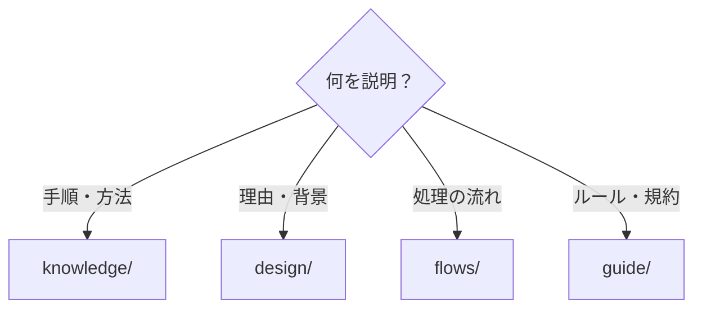
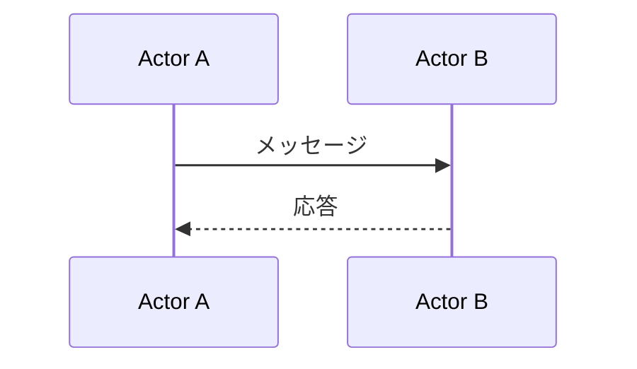
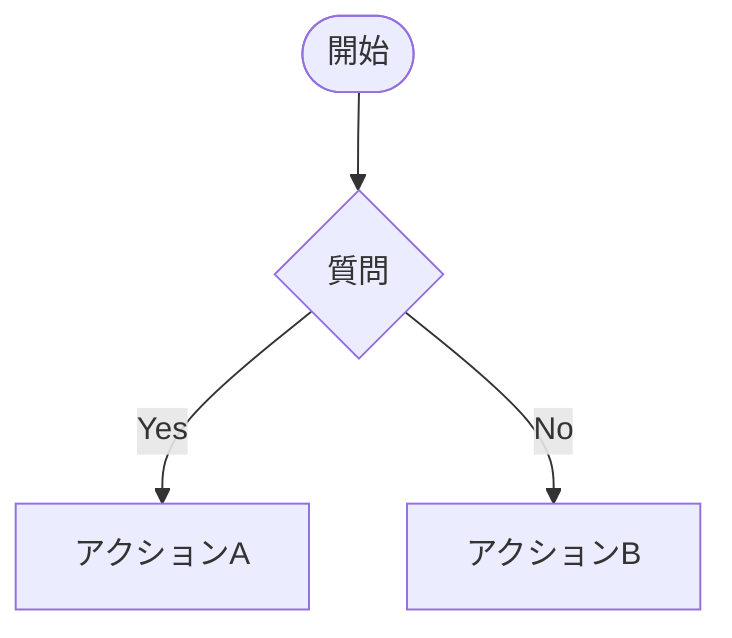
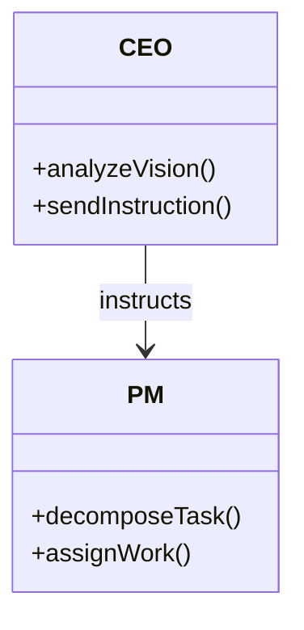

# ドキュメント作成ガイド

> このガイドは、agent-corpプロジェクトでLLM/探索型ワークフローに最適化されたドキュメントを作成するためのガイドラインです。

## 基本原則

### 1. コンテキストエンジニアリング

LLMがドキュメントを効率的に理解できるよう、以下を意識してください：

- **明確な構造**: 見出しレベルを適切に使い分ける
- **簡潔な文章**: 1文1意を心がける
- **具体的な例**: 抽象的な説明には具体例を添える
- **相互リンク**: 関連ドキュメントへのリンクを明示

### 2. 探索型ワークフロー対応

LLMが必要な情報を素早く見つけられるよう、以下を意識してください：

- **TL;DR**: 長いドキュメントには冒頭に要約を置く
- **インデックス**: ディレクトリREADMEにドキュメント一覧を維持
- **ファイルパス**: 関連ファイルは絶対パスまたは相対パスで明示
- **行番号**: コード参照時は行番号を含める（例: `src/main.ts:42`）

---

## ディレクトリ構成と役割

| ディレクトリ | 役割 | キーワード |
|-------------|------|-----------|
| `docs/knowledge/` | 実践的知識（HOW） | 「〜する方法」「〜のやり方」 |
| `docs/design/` | 設計思想（WHY） | 「なぜ〜」「〜の理由」 |
| `docs/flows/` | 処理フロー（WHAT） | 「〜のフロー」「〜の順序」 |
| `docs/guide/` | ガイドライン | 「〜のルール」「〜の規約」 |
| `docs/_templates/` | テンプレート | - |

### カテゴリ選択のフローチャート



---

## ドキュメント構成テンプレート

### 基本構成

```markdown
# タイトル

## 概要
このドキュメントの目的を1-2文で説明

## 本文
...

## 関連ドキュメント
- [リンク1](./xxx.md)
- [リンク2](./yyy.md)

## 更新履歴
- YYYY-MM-DD: 初版作成
```

### カテゴリ別テンプレート

- **knowledge**: [実践的知識テンプレート](../knowledge/README.md#ドキュメント作成ガイドライン)
- **design**: [設計思想テンプレート](../design/README.md#ドキュメント作成ガイドライン)
- **flows**: [フローテンプレート](../_templates/flow.md)

---

## Mermaid図の活用

処理フローや関係性を視覚化するためにMermaid図を活用してください。

### シーケンス図（処理フロー向け）

```markdown

```

### フローチャート（決定木向け）

```markdown

```

### クラス図（構造向け）

```markdown

```

---

## 相互リンクの戦略

### リンクの種類

| リンク種別 | 用途 | 例 |
|-----------|------|-----|
| 親子リンク | 上位/下位カテゴリへの参照 | `[戻る](../README.md)` |
| 兄弟リンク | 同カテゴリ内の関連ドキュメント | `[関連](./related.md)` |
| 横断リンク | 他カテゴリへの参照 | `[設計](../design/xxx.md)` |

### リンク記述のルール

1. **相対パス**を使用（絶対パスより保守性が高い）
2. **リンクテキスト**は内容を表す文言にする
3. **存在しないファイル**へのリンクは避ける（TODO管理で対応）

---

## コンテキストサイズの最適化

LLMのコンテキストウィンドウを効率的に使うために：

### 推奨

- 1ドキュメントあたり **300行以内** を目安
- 長くなる場合は複数ファイルに分割
- 繰り返しの説明は共通ドキュメントへリンク

### 避けるべき

- 同じ内容の重複記載
- 過度に長いコードブロック
- 画像の乱用（テキストで説明できる内容）

---

## チェックリスト

新しいドキュメントを作成したら、以下を確認してください：

- [ ] 適切なカテゴリに配置した
- [ ] 親READMEのインデックスに追加した
- [ ] 概要セクションがある
- [ ] 関連ドキュメントへのリンクがある
- [ ] 更新履歴を記載した
- [ ] Mermaid図が正しく表示される
- [ ] 相対リンクが正しく機能する

---

## 関連ドキュメント

- [docs/README.md](../README.md) - ドキュメント全体のインデックス
- [docs/_templates/flow.md](../_templates/flow.md) - フローテンプレート

---

## 更新履歴

- 2025-01-24: 初版作成
