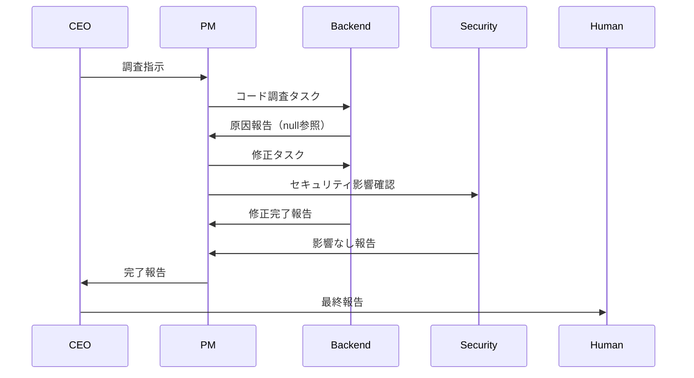

# ユースケース集

agent-corpを使った実際の開発シナリオと、その実行手順を紹介します。

---

## ユースケース 1: Webアプリケーションの新機能開発

### シナリオ

「ユーザー認証機能を持つTodoアプリを作成したい」という要件に対して、agent-corpを使って自律的に開発を進める。

### 手順

#### 1. 要件の作成

```bash
./scripts/msg.sh send \
    --from human \
    --to ceo \
    --type requirement \
    --priority high \
    --title "Todoアプリの開発" \
    --body "## 概要
ユーザー認証機能を持つシンプルなTodoアプリを開発してください。

## 機能要件
- ユーザー登録・ログイン・ログアウト
- Todoの作成・編集・削除・完了
- ユーザーごとのTodo管理

## 技術スタック
- Frontend: React + TypeScript
- Backend: Python + FastAPI
- Database: PostgreSQL

## 期待する成果
- 動作するアプリケーション
- 基本的なテスト
- READMEドキュメント"
```

#### 2. CEOウィンドウでの作業

CEOウィンドウ（`Ctrl+b` → `0`）に移動し、Claude Codeを起動：

```bash
claude --system-prompt prompts/ceo.md
```

CEOに要件を分析させ、PMへの指示を作成：

```
# 新しい要件を確認してください
cat shared/requirements/YYYYMMDD-001-req.md

# 分析してPMへの指示を作成してください
```

#### 3. PMウィンドウでの作業

PMウィンドウ（`Ctrl+b` → `1`）でタスクを分解：

```bash
claude --system-prompt prompts/pm.md
```

PMがタスクを各Engineerに割り当て：

- Frontend: UI実装、認証フロー
- Backend: API実装、認証ロジック
- Security: 認証セキュリティレビュー

#### 4. Engineerウィンドウでの作業

Engineersウィンドウ（`Ctrl+b` → `2`）の各ペインで実装：

```bash
# Frontend（左ペイン）
claude --system-prompt prompts/engineers/frontend.md

# Backend（右上ペイン）
claude --system-prompt prompts/engineers/backend.md

# Security（右下ペイン）
claude --system-prompt prompts/engineers/security.md
```

#### 5. 進捗の監視

```bash
# ダッシュボードで監視
./scripts/monitor.sh dashboard

# または状態確認
./scripts/monitor.sh status
```

### 期待される成果物

```
project/
├── frontend/
│   ├── src/
│   │   ├── components/
│   │   ├── pages/
│   │   └── hooks/
│   └── package.json
├── backend/
│   ├── app/
│   │   ├── api/
│   │   ├── models/
│   │   └── services/
│   └── requirements.txt
├── docker-compose.yml
└── README.md
```

---

## ユースケース 2: 既存コードのリファクタリング

### シナリオ

「レガシーなJavaScriptコードをTypeScriptに移行し、テストを追加したい」

### 手順

#### 1. 要件の作成

```bash
./scripts/msg.sh send \
    --from human \
    --to ceo \
    --type requirement \
    --priority medium \
    --title "TypeScript移行とテスト追加" \
    --body "## 概要
既存のJavaScriptコードをTypeScriptに移行し、テストカバレッジを向上させてください。

## 対象
- src/utils/*.js
- src/services/*.js

## 要件
- TypeScript厳格モード対応
- 型定義ファイルの作成
- Jest によるユニットテスト（カバレッジ80%以上）
- 既存の動作を維持

## 制約
- 破壊的変更を避ける
- 段階的に移行可能にする"
```

#### 2. タスク分解の例

PMが作成するタスク：

**Frontend Engineer向け:**
```markdown
# タスク: utils/*.js のTypeScript移行

## 説明
src/utils/ 配下のJavaScriptファイルをTypeScriptに移行

## 完了条件
- [ ] .js を .ts に変換
- [ ] 型定義を追加
- [ ] 既存のテストが通る
- [ ] ESLintエラーがない

## ファイル一覧
- formatDate.js → formatDate.ts
- validateEmail.js → validateEmail.ts
- ...
```

### 期待される成果

- TypeScript移行完了
- 型定義ファイル（.d.ts）
- テストファイル
- カバレッジレポート

---

## ユースケース 3: バグ調査と修正

### シナリオ

「本番環境で特定の条件下でエラーが発生している。原因を調査して修正したい」

### 手順

#### 1. 要件の作成

```bash
./scripts/msg.sh send \
    --from human \
    --to ceo \
    --type requirement \
    --priority critical \
    --title "本番エラーの調査と修正" \
    --body "## 問題
本番環境で以下のエラーが発生しています：

\`\`\`
TypeError: Cannot read property 'id' of undefined
  at UserService.getProfile (src/services/user.ts:45)
\`\`\`

## 発生条件
- 新規ユーザーがプロフィールページにアクセスした時
- 発生頻度: 約10%のユーザー

## 要件
- 根本原因の特定
- 修正パッチの作成
- 再発防止策の提案
- 回帰テストの追加"
```

#### 2. 調査フロー



#### 3. 質問・回答の活用

調査中に不明点があれば質問を送信：

```bash
./scripts/msg.sh send \
    --from backend \
    --to pm \
    --type question \
    --priority high \
    --title "ユーザーデータの取得タイミング" \
    --body "## 質問
UserService.getProfile が呼ばれる前に、
ユーザーデータがDBに存在することは保証されていますか？

## 背景
新規ユーザーの場合、プロフィール作成が非同期で行われている可能性があります。"
```

---

## ユースケース 4: ドキュメント作成

### シナリオ

「APIドキュメントとアーキテクチャ図を作成したい」

### 手順

#### 1. 要件の作成

```bash
./scripts/msg.sh send \
    --from human \
    --to ceo \
    --type requirement \
    --priority medium \
    --title "技術ドキュメントの作成" \
    --body "## 概要
開発者向けの技術ドキュメントを整備してください。

## 成果物
1. API仕様書（OpenAPI形式）
2. アーキテクチャ図（Mermaid）
3. 開発者向けセットアップガイド
4. コーディング規約

## 対象読者
- 新規参加の開発者
- 外部の連携パートナー"
```

#### 2. タスク分配

| Engineer | タスク |
|----------|-------|
| Backend | API仕様書、認証フロー図 |
| Frontend | コンポーネント構成図、状態管理図 |
| Security | セキュリティガイドライン |

---

## ユースケース 5: コードレビュー

### シナリオ

「プルリクエストのコードレビューを自動化したい」

### 手順

#### 1. レビュー要件の作成

```bash
./scripts/msg.sh send \
    --from human \
    --to ceo \
    --type requirement \
    --priority medium \
    --title "PRレビュー: feature/user-settings" \
    --body "## 概要
以下のプルリクエストをレビューしてください。

## PR情報
- Branch: feature/user-settings
- 変更ファイル数: 12
- 追加行数: 450
- 削除行数: 120

## レビュー観点
- コード品質
- セキュリティ
- パフォーマンス
- テストカバレッジ

## 出力形式
- 問題点のリスト（重大度付き）
- 改善提案
- 承認可否の判断"
```

#### 2. 並列レビュー

各Engineerが専門分野でレビュー：

- **Frontend**: UIコンポーネントのレビュー
- **Backend**: ビジネスロジックのレビュー
- **Security**: セキュリティのレビュー

---

## ベストプラクティス

### 1. 要件は具体的に

```markdown
❌ Bad: ログイン機能を作ってください
✅ Good: OAuth2.0を使用したGoogleログイン機能を実装してください
        - リダイレクトフロー
        - トークンの安全な保存
        - セッション管理
```

### 2. 優先度を適切に設定

| 優先度 | 用途 |
|--------|------|
| critical | 本番障害、セキュリティ問題 |
| high | 締め切りのある機能開発 |
| medium | 通常の開発タスク |
| low | 改善、リファクタリング |

### 3. 監視を活用

```bash
# ダッシュボードを別ターミナルで起動
./scripts/monitor.sh dashboard

# または、tmuxの別ウィンドウで
Ctrl+b c  # 新規ウィンドウ
./scripts/monitor.sh dashboard
```

### 4. ログをエクスポート

```bash
# 作業完了後にログを保存
./scripts/monitor.sh export --format md --output report.md
```

---

## 関連ドキュメント

- [セットアップガイド](./setup.md)
- [トラブルシューティング](./troubleshooting.md)
- [メッセージプロトコル](../design/message-protocol.md)

---

## 更新履歴

- 2025-01-24: 初版作成
