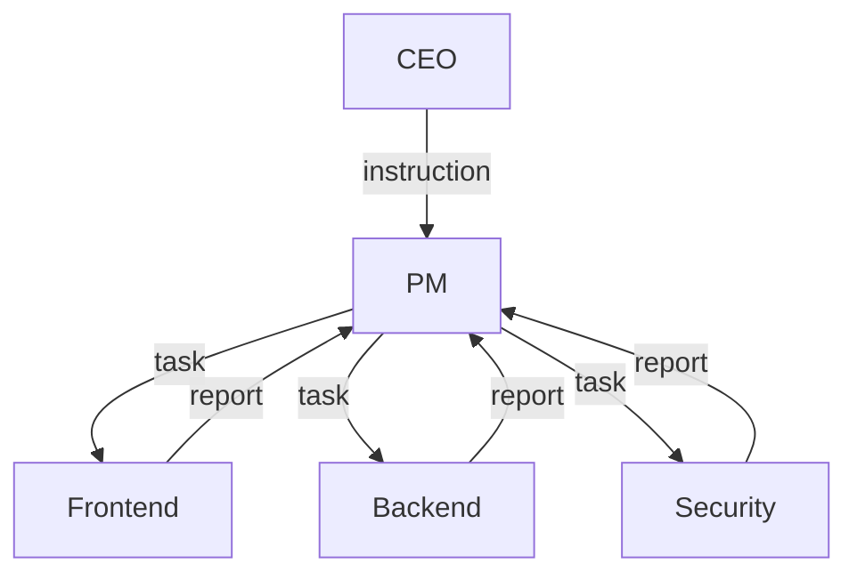

# エージェントプロンプト設計ガイド

agent-corpで使用するシステムプロンプトの設計パターンと実装ガイド。

---

## 概要

各AIエージェントは専用のシステムプロンプトを持ち、役割・責任・通信プロトコルが定義されています。

```
prompts/
├── ceo.md              # CEO AI プロンプト
├── pm.md               # PM AI プロンプト
└── engineers/
    ├── frontend.md     # Frontend Engineer
    ├── backend.md      # Backend Engineer
    └── security.md     # Security Engineer
```

---

## プロンプト構造

### 標準セクション

すべてのプロンプトは以下のセクションで構成されます。

```markdown
# [ロール名]

## 役割と責任
[このエージェントの主要責任]

## 上位者
[報告先とその役割]

## 下位者
[管理対象とその役割]

## コミュニケーションプロトコル
### 入力メッセージ
[受信するメッセージタイプと処理方法]

### 出力メッセージ
[送信するメッセージタイプとフォーマット]

## 判断基準
[意思決定のガイドライン]

## ファイル操作
[読み書きできるディレクトリ]

## 行動指針
[具体的な行動ルール]
```

---

## ロール別プロンプト設計

### CEO AI (`prompts/ceo.md`)

**責任範囲**:
- ビジョンと戦略の解釈
- 高レベル指示の策定
- 最終成果物の承認

**入力**: `requirement` (human から)
**出力**: `instruction` (PM へ)


**設計ポイント**:
1. 要件を戦略的視点で解釈
2. 技術的詳細には踏み込まない
3. PMへの指示は方向性を示す

### PM AI (`prompts/pm.md`)

**責任範囲**:
- タスク分解と優先順位付け
- エンジニアへの作業割り当て
- 進捗管理とレビュー

**入力**: `instruction` (CEO から)
**出力**: `task` (Engineers へ)



**設計ポイント**:
1. 指示を具体的なタスクに分解
2. 依存関係を考慮した割り当て
3. 品質基準の明示

### Engineer AI (`prompts/engineers/*.md`)

**責任範囲**:
- 専門領域の実装
- コードレビュー
- 技術的問題の解決

**入力**: `task` (PM から)
**出力**: `report`, `question` (PM へ)

**設計ポイント**:
1. 専門領域に特化した知識
2. 実装詳細の決定権限
3. 不明点は質問で確認

---

## 通信プロトコルの実装

### メッセージ監視パターン

```markdown
## コミュニケーションプロトコル

### 入力メッセージ
1. `shared/instructions/pm/` を監視
2. 新規ファイルを検出したら処理開始
3. ファイルを `processing/` に移動
4. 処理完了後 `archive/` に移動

### 出力メッセージ
1. タスクファイルを作成
2. `shared/tasks/{engineer}/inbox/` に配置
3. ステータスを `pending` に設定
```

### ステータス管理

```yaml
# メッセージのステータス遷移
status:
  - pending      # 未処理
  - in_progress  # 処理中
  - completed    # 完了
  - blocked      # ブロック中
```

---

## カスタムプロンプト作成

### 新規ロールの追加手順

1. **役割定義**: 責任範囲を明確化
2. **階層配置**: 上位者・下位者を決定
3. **通信設計**: メッセージタイプを定義
4. **プロンプト作成**: テンプレートに従って記述

### テンプレート

```markdown
# [新規ロール名]

## 役割と責任
- [責任1]
- [責任2]
- [責任3]

## 上位者
- **[上位ロール]**: [その役割の説明]

## 下位者
- **[下位ロール1]**: [その役割の説明]
- **[下位ロール2]**: [その役割の説明]

## コミュニケーションプロトコル

### 入力メッセージ
| タイプ | 送信元 | 監視ディレクトリ |
|--------|--------|-----------------|
| [type] | [from] | shared/[path]/  |

### 出力メッセージ
| タイプ | 送信先 | 出力ディレクトリ |
|--------|--------|-----------------|
| [type] | [to]   | shared/[path]/  |

## 判断基準
1. [基準1]
2. [基準2]

## ファイル操作
- **読み取り**: `shared/[paths]/`
- **書き込み**: `shared/[paths]/`

## 行動指針
1. [指針1]
2. [指針2]
3. [指針3]
```

---

## ベストプラクティス

### 1. 明確な境界設定

```markdown
## 権限の境界

### できること
- タスクの分解と割り当て
- 進捗状況の確認
- 完了レポートの作成

### できないこと
- 実装の詳細決定（Engineerの権限）
- 戦略変更（CEOの権限）
- 直接的なコード修正
```

### 2. エスカレーションルール

```markdown
## エスカレーション

以下の場合は上位者に報告:
1. タスクの優先順位が不明確な場合
2. リソース不足でスケジュールに影響がある場合
3. 技術的判断が戦略に影響する場合

報告形式:
- 状況の要約
- 選択肢の提示
- 推奨アクション
```

### 3. コンテキスト最適化

```markdown
## コンテキスト管理

### 参照すべきファイル
- `shared/specs/requirements/` - 要件定義
- `shared/specs/api/` - API仕様
- `shared/artifacts/` - 成果物

### 状態の保持
- 現在のタスク一覧を `shared/logs/` に記録
- 処理済みメッセージは `archive/` に移動
```

---

## トラブルシューティング

### プロンプトが機能しない場合

| 症状 | 原因 | 対処 |
|------|------|------|
| メッセージを無視する | 監視ディレクトリの誤り | パスを確認 |
| 権限外の操作をする | 境界設定が不明確 | 明示的に禁止事項を追加 |
| 上位者に報告しない | 出力プロトコルの不備 | 出力セクションを強化 |

---

## 関連ドキュメント

- [メッセージプロトコル](../design/message-protocol.md) - 通信規約
- [共有ディレクトリ](../design/shared-directory.md) - ファイル構成
- [組織階層](../design/org-hierarchy.md) - 階層構造
